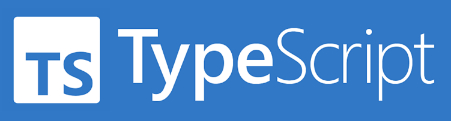

## Typescript 스터디

<h4><a style='color:lightyellow' href='https://polarized-income-39d.notion.site/94033567d184490a8e3bf4cebfa7f425?pvs=4'>스터디 노션 페이지</a></h4>

#### 참여인원

|                                유명인                                 |                              김민규                              |                                              강동욱                                              |                              송희면                               |
| :-------------------------------------------------------------------: | :--------------------------------------------------------------: | :----------------------------------------------------------------------------------------------: | :---------------------------------------------------------------: |
|  |  |  |  |

---

## 진행 현황

**2023.11.20 - 2023.11.23**

우아한 타입스크립트 with 리액트 1장

**웹 개발의 역사**

---

**2023.11.23 - 2023.11.26**

우아한 타입스크립트 with 리액트 2장 2-1, 2-2

**타입이란**

---

**2023.11.26 - 2023.11.30**

우아한 타입스크립트 with 리액트 2장 2-3, 2-4, 3-1

**원시타입**
**타입스크립트만의 독자적 타입 시스템**

---

**2023.11.30 - 2023.12.3**

우아한 타입스크립트 with 리액트 3장 3-2, 3-3

**타입 조합**

---

**2023.12.3 ~ 2023.12.7**

우아한 타입스크립트 with 리액트 4장

**타입 확장하기**

---

**2023.12.7 ~ 2023.12.10**

우아한 타입스크립트 with 리액트 5장

**타입 확장하기**

우아한 타입스크립트 with 리액트 5-1, 5-2, 5-3

---

**2023.12.14 ~ 2023.12.17**

우아한 타입스크립트 with 리액트 6장

**타입 확장하기**

우아한 타입스크립트 with 리액트 6장

---

**2023.12.17 ~ 2023.12.21**

우아한 타입스크립트 with 리액트 7장

**타입 확장하기**

우아한 타입스크립트 with 리액트 7장
