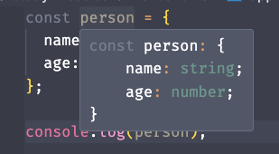
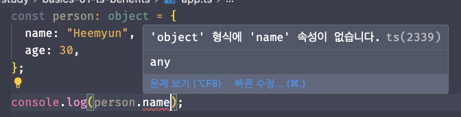
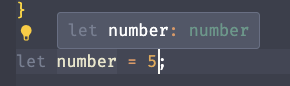
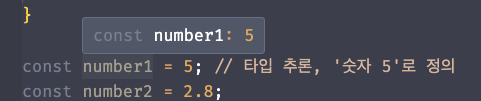
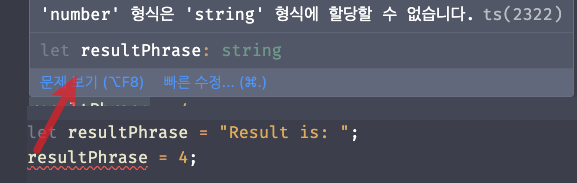

## 목차

[2 타입](#2.-타입)

- [2.1 타입이란](#2.1-타입이란)
- [2.2 타입스크립트의 타입 시스템](#2.2-타입스크립트의-타입-시스템)
- [2.3 원시 타입](#2.3-원시-타입)
- [2.4 원시 타입](#2.4-객체-타입)

---

# 2. 타입

## 2.1 타입이란

### 2.1.1 자료형으로서의 타입

변수에 저장할 수 있는 값의 종류는 아래와 같다.

자바스크립트의 7가지 데이터 타입(`자료형`)이 있다.

- `undefined`
- `null`
- `Boolean`
- `String`
- `Symbol`
- `Numeric` (`Number`, `BigInt`)
- `Object`

> 데이터 타입 : 여러 종류의 데이터를 식별하는 분류 체계로 컴파일러에 값의 형태를 알려준다.

### 2.1.2 집합으로서의 타입

프로그래밍에서의 타입은 수학의 집합과 유사하다.  
타입은 값이 가질 수 있는 유효한 범위의 집합이다.

### 2.1.3 정적 타입과 동적 타입

타입을 결정하는 시점에 따라 분류한다.

1. 자바스크립트는 동적 타입을 사용한다.
   처음엔 숫자를 입력했다가 나중에 문자열을 입력해도 문제가 없다.

2. 타입스크립트는 정적 타입이다.
   이말은 즉슨, **개발 시**에 변수와 매개변수의 타입 정의가 끝난다는 의미.
   **런타임에 변경되지 않는다.**

> JavaScript uses "Dynamic Types" (resolved at runtime)
> TypeScript uses "Static Types" (set during development, at compile)

> 컴파일타임과 런타임
>
> > 컴파일 : 기계가 소스코드를 이해할 수 있도록 기계어로 변환되는 시점
> > 런타임 : 컴파일 후 변환된 파일이 메모리에 적재되어 실행되는 시점

### 2.1.4 강타입과 약타입

타입이 결정되는 시점은 다르지만 모든 프로그래밍 언어에는 값의 타입이 존재한다.

#### 암묵적 타입 변환

의도적으로 타입을 명시하거나 바꾸지 않았는데도 컴파일러 또는 엔진 등에 의해 런타임에 타입이 자동으로 변환되는 것

#### 암묵적 타입 변환의 종류

##### 1. 강타입 (strongly type)

타입스크립트

서로 다른 타입을 갖는 값끼리 연산을 시도하면 컴파일러 또는 인터프리터에서 에러가 발생

```ts
console.log("2" - 1); // "2" error
```

##### 2. 약타입 (weakly type)

자바스크립트

서로 다른 타입을 갖는 값끼리 연산을 할 때는 컴파일러 또는 인터프리터가 내부적으로 판단해서 특정 값의 타입을 변환하여 연산을 수행한 후 값을 도출

```js
console.log("2" - 1); // 1
```

암묵적 변환은 개발자가 명시적으로 타입을 변환하지 않아도 다른 데이터 타입끼리 연산을 진행할 수 있는 편리함을 제공하지만, 작성자의 의도와는 다른 동작으로 인하여 예기치 못한 오류가 발생할 가능성도 높아진다.

자바스크립트는 약타입 언어이기 때문에 런타임에서 발생할 수 있는 에러를 예측하고 방지하는 코드를 작성하는 것이 프로그램을 **안전**하게 만드는 데 도움이 된다.

> '안전한'이라는 표현은 타입 안전성을 의미한다.

##### 타입 시스템

타입 검사기가 프로그램에서 타입을 할당하는 데 사용하는 규칙 집합을 타입 시스템이라 한다.

타입 시스템은 두 가지로 구분 된다.

1. 어떤 타입을 사용하는지 컴파일러에게 명시적으로 알려주는 타입 시스템
2. 자동으로 타입을 추론하는 타입 시스템

### 2.1.5 컴파일 방식

#### 컴파일

사람이 이해하는 코드를 컴퓨터가 이해할 수 있는 기계어로 바꿔주는 과정
즉, 고수준 언어 `-컴파일러->` 바이너리 코드로 변환

<br><br>

## 2.2 타입스크립트의 타입 시스템

타입스크립트는 자바스크립트 코드를 **컴파일 하기 전**, 개발을 할 때만 도움이 된다.
런타임 코드를 변경하는 것이 아님.

- 별도의 단계가 생기고
- 추가 검사를 하기 때문에
  실수를 알아차릴 수 있다.

### 2.2.1 타입 애너테이션(type annotation) 방식

변수나 상수 혹은 함수의 인자와 반환 값에 **타입을 명시적으로 선언**해서 어떤 타입 값이 저장될 것인지를 컴파일러에 **직접** 알려주는 문법

### 2.2.2 구조적 타이핑(Structual type system)

타입스크립트는 **구조**로 타입을 구분한다. (이름으로 타입을 구분하는 명목적 타입 언어의 특징과 비교된다.)

### 2.2.3 구조적 서브타이핑

타입스크립트의 타입은 **값의 집합**으로 생각할 수 있다.

```ts
type stringOrNumber = string | number;
```

이처럼 집합으로 나타낼 수 있는 타입스크립트의 타입 시스템을 지탱하고 있는 개념이 바로 **구조적 서브타이핑**이다.

#### 구조적 서브타이핑

**객체가 가지고 있는 속성(프로퍼티)을 바탕으로 타입을 구분**하는 것이다.
이름이 다른 객체라도 **가진 속성이 동일**하다면 **타입스크립트는 서로 호환이 가능한 동일 타입**으로 여긴다.

```ts
interface Pet {
  name: string;
}

interface Cat {
  name: string;
  age: number;
}

let pet: Pet;
let cat: Cat = { name: "zag", age: 2 };

pet = cat; // OK
```

위 코드에서 Cat은 Pet은 다른 타입으로 선언되었지만, Pet이 갖고 있는 name이라는 속성을 가지고 있다.  
따라서 Cat 타입으로 선언한 cat을 Pet타입으로 선언한 pet에 할당할 수 있다.

### 2.2.4 자바스크립트를 닮은 타입스크립트

- 명목적 타이핑
  : 타입의 구조가 아닌 타입의 이름만으로 구별 (C++, JAVA)
  -> 그렇기 때문에 구조가 같아도 이름이 다르면 다른 타입으로 취급한다.

- 구조적 서브타이핑
  : 객체가 가지고 있는 속성을 바탕으로 타입을 구별 (TS)

- 덕 타이핑
  : 어떤 함수의 매개변숫값이 올바르게 주어진다면 그 값이 어떻게 만들어졌는지 신경쓰지 않고 사용한다는 개념
  > 어떤 타입에 부합하는 변수와 메서드를 가질 경우 해당 타입에 속하는 것으로 간주하는 방식이다.

> 타입을 검사하는 시점에 따라 구분되어진다.
>
> > 구조적 타이핑 - 컴파일타임에 타입 검사
> > 덕 타이핑 - 런타임에 타입 검사

### 2.2.5 구조적 타이핑의 결과

어떤 속성을 지닐지 알 수 없으며, 특정 타입이라고 확정할 수 없어서 에러가 발생하는 경우가 있다.
-> 유니온으로 한계를 극복할 수 있다.

### 2.2.6 타입스크립트의 점진적 타입 확인

#### 점진적 타입 검사

컴파일타임에 타입을 검사하면서 필요에 따라 타입 선언 생략을 허용하는 방식

### 2.2.7 자바스크립트 슈퍼셋으로서의 타입스크립트

### 2.2.8 값 vs 타입

### 2.2.9 타입을 확인하는 방법

<br><br>

## 2.3 원시 타입

자바스크립트에서 값은 타입을 가지지만 변수는 별도의 타입을 가지지 않으므로 변수에 어떤 타입의 값이라도 자유롭게 할당할 수 있다.

타입스크립트는 변수에 타입을 지정할 수 있는 타입 시스템 체계를 구축한다.

> 타입 시스템
>
> > 특정 타입을 지정한 변수에 해당 타입의 값만 할당할 수 있다

### 2.3.1 `boolean`

오직 `true`와 `false`값만 할당할 수 있는 boolean 타입이다.

```ts
const isEmpty: boolean = true;
const isLoading: boolean = false;
```

`falsy` 한 값 : `0`(`0`, `-0`, `0n` - BigInt 타입), `null`, `undefined`, `''`, `NaN`, `false`

### 2.3.2 `undefined`

`정의되지 않았다`는 의미의 타입이다.
초기화가 되어 있지 않거나 존재하지 않음을 뜻함.

```ts
let value: string;
console.log(value); // undefined

type Person = {
  job?: string; // optional을 쓰거나,
  job: string | undefined; // 혹은 유니언을 사용하여 표현할 수 있다.
};
```

### 2.3.3 `null`

보통 빈 값을 할당할 때 사용.
오직 null만 할당할 수 있다.  
명시적, 의도적으로 값이 아직 비어있을 수 있음을 보여준다.

null과 undefined를 혼용하는데, 엄연히 따로 존재하는 원시 값이다.

```ts
type Person1 = {
  name: string;
  // job의 속성이 있을 수도 또는 없을 수도 있음.
  job?: string;
};

type Person2 = {
  name: string;
  // job의 속성은 있으나 값이 비어있을 수 있음. 명시적인 null 을 할당하여 무직임을 나타낸다.
  job: string | null;
};
```

### 2.3.4 `number`

자바스크립트의 숫자는 모두 `number` 타입이다.

- 정수, 부동소수점을 구분하지 않는다.
- `NaN`, `infinity`도 `number`로 포함된다.

타입스크립트에서 모든 숫자는 기본적으로 `float`(실수)이다.

> Java의 경우 byte,short,int,long,double,float 등 다양한 숫자 타입이 있음.

```ts
const maxLength: number = 10;
const maxWidth: number = 120.3;
const maximum: number = +Infinity;
const notANumber: number = NaN;
```

```ts
// 모두 number 이다.
const number1 = 5; // 5.0과 같다
const number2 = 2.8;
```

### 2.3.5 `bigInt`

ES2020에 새롭게 도입.

자바스크립트에서는 가장 큰 수인 `Number.MAX_SAFE_INTEGER(2^53 - 1)`을 넘어가면 처리할 수 없었다.
`bigInt`를 사용하면 처리가 가능하다.

그러나, number 타입과는 엄연히 서로 다른 타입이라 상호 작용은 불가능하다.

```ts
const bigNumber1: bigInt = BigInt(999999999999);
const bigNumber2: bigInt = 999999999999n;
```

### 2.3.6 `string`

문자열을 할당할 수 있는 타입.
공백도 string 타입.

`"`Hi`"`, `'`HI`'`

```js
`HI`;
```

### 2.3.7 `symbol`

Symbol() 은 어떤 값과도 중복되지 않는 유일한 값을 생성한다.

```ts
// 동일한 문자열을 넘겨줬어도 서로 다른 값을 가지고 있음을 알 수 있다.
const MOVIE_TITLE = Symbol("title");
const MUSIC_TITLE = Symbol("title");
console.log(MOVIE_TITLE === MUSIC_TITLE); // false
```

```ts
// unique symbol 타입이라는 symbol의 하위 타입도 있다.
let SYMBOL: unique symbol = Symbol();
```

> 타입스크립트의 모든 타입은 기본적으로 null, undefined를 포함하고 있다.
> ts-config의 strictNullChecks 옵션 활성화했을 때 명시적으로 타입에 포함해야만 사용할 수 있다.

> null, undefined을 걸러내는 방법
>
> > 타입 가드 : 타입 좁히기
> > 타입 단언 : `!` 연산자를 사용 (null, undefined가 아니라고 보장)

<br><br>

## 2.4 객체 타입

자바스크립트에서 객체의 범주는 원시 타입에 비해 굉장히 넓다. 이를 모두 객체라 일컫는다.  
타입스크립트에서는 다양한 형태를 가지는 객체마다 개별적으로 타입을 지정할 수 있다.

### 2.4.1 `Object`

타입스크립트 타입 시스템은 object 타입이다.  
가급적 상용하지 말도록 권장되는데 any타입과 유사하게 모든 타입 값을 유동적으로 할당할 수 있기에 정적 타이핑의 의미가 퇴색되기 때문.

---

타입스크립트에서의 object는 좀 더 **구체적**이다.



아래 코드는 에러가 발생한다.

```ts
// const person: {} = {...}
const person: object = {
  name: "Heemyun",
  age: 30,
};

console.log(person.name);
/**
 * 속성이 없는 것은 물론이고,
 * 존재하는 속성에 접근하려 해도 에러를 뿜는다.
 * 왜? 구체적으로 객체에 관해 아무 정보도 주지 않았기 때문이다.
 */
```



구체적으로 타입을 명시하여 할당한다.

```ts
// GOOD!
const person: {
  name: string;
  age: number;
} = {
  name: "Heemyun",
  age: 30,
};

console.log(person.name);
```

### 2.4.2 `{}`

타입스크립트에서 중괄호(`{}`) 안에 객체의 속성 타입을 지정해주는 식으로 사용한다.
이것은 타이핑되는 객체가 중괄호 안에서 선언된 구조와 일치해야 함을 뜻한다.

```ts
// 정상
const noticePopup: { title: string; description: string } = {
  title: "타이틀",
  description: "부가 설명",
};

// SyntaxError
const noticePopup: { title: string; description: string } = {
  title: "타이틀",
  description: "부가 설명",
  startAt: "2022", // startAt은 지정한 타입에 존재하지 않기 때문에 오류
};
```

#### `{}` 빈 객체일 경우 유틸리티 타입을 사용한다.

```ts
// 정상
let noticePopup: {} = {};
noticePopup.title = "이렇게 속성을 지정할 수 없다";
```

```ts
// 유틸리티 타입 사용 예시
let emptyObject: Record<string, never> = {};

// Record<K, T> 타입은 모든 프로퍼티의 키가 K이고 값이 T인 객체를 나타낸다.
// never 타입은 절대 발생할 수 없는 타입을 나타낸다.
```

### 2.4.3 `array`

타입스크립트는 자바스크립트 객체를 세분화해서 타입을 지정할 수 있는 타입 시스템을 갖는다.

#### 객체의 범주

객체 자료구조, 배열, 함수, 정규식 등

자바스크립트의 배열 자료구조는 원소를 자유롭게 추가하고 제거할 수 있으며 타입 제한 없이 다양한 값을 다룬다.  
즉 하나의 배열 안에 숫자, 문자열과 같은 서로 다른 값이 혼재될 수 있는데, 이런 쓰임은 타입스크립트가 추구하는 정적 타이핑 방향과는 맞지 않다.

```ts
const getCartList = async (cartId: number[]) => {
  const res = await CartApi.GET_CART_LIST(cartId);
  return res.getData();
};

getCartList([]); // 빈 배열 가능
getCartList([1001]); // 가능
getCartList([1, 2, 3, 4]); // number 타입 원소 몇 개가 들어와도 가능
getCartList([1, "2"]); // string 안 됨
```

> 튜플 : 원소의 개수와 타입을 미리 정한다.

### 2.4.4 `type`과 `interface` 키워드

object 타입은 잘 사용하지 않는다.

객체를 타이핑하기 위해 자주 사용하는 키워드로는 `type`과 `interface` 가 있다.

- type : 정적으로 결정되어 있는 것
- interface : 확장될 수 있는 Basis를 정의

```ts
// 중괄호를 사용한 객체 리터럴 방식으로는 타입을 매번 일일이 지정해야하고 중복적인 요소가 많다.
// 그래서 type, interface를 사용하면 반복적으로 사용돼도 중복 없이 해당 타입을 쓸 수 있다.

type NoticePopupType = {
  title: string;
  desc: string;
}

interface INoticePopup {
  title: string;
  desc: string;
}

const noticePopup1: NoticePopupType = { ... };
const noticePopup2: INoticePopup = { ... };
```

타입스크립트에서는 일반적으로 변수 타입을 명시적으로 선언하지 않아도 컴파일러가 자동으로 타입을 추론한다.
즉, 변수 사용 방식과 할당된 값의 타입을 분석하여 타입을 유추한다는 것을 의미한다.  
명시적으로 일일이 선언할 필요가 없다는 뜻이다.

(그러나 타입 추론을 온전히 맡길 것인지 명시적 타입 선언을 할 것인지는 컨벤션과 취향에 따라 갈린다.)

### 2.4.5 `function`

`function`도 별도의 타입이다.

#### 주의점

1. `function` 이라는 키워드 자체를 타입으로 사용하지 않는다는 점
2. 매개변수 목록도 별도의 타입으로 지정해야 한다는 점

위 주의점을 적용하여 함수를 타이핑한 예시다.

```ts
function add(a: number, b: number): number {
  return a + b;
}
```

함수 자체의 타입은 어떻게 지정하나?

#### 호출 시그니처

타입스크립트에서 **함수 타입을 정의**할 때 사용하는 문법이다.
함수 자체의 타입을 명시할 땐 화살표 함수 방식으로만 호출 시그니처를 정의한다.

함수 타입은 해당 함수가 받는 **매개변수**와 **반환하는 값의 타입**으로 결정된다.
**호출 시그니처**는 이러한 함수의 매개변수와 반환 값의 타입을 명시하는 역할을 한다.

```ts
type add = (a: number, b: number) => number;
```

---

### 타입 할당 및 추론하기

#### 타입 할당

```ts
/** [명시적 타입 할당]
 * 명시적으로 타입을 할당했다.
 * 타입스크립트만 이해하는 구문이다.
 */
const num: number;
```

```ts
/**
 * 직접 타입을 설정하거나 초기화 한다.
 * 작업이 중복되기도 하고, '타입 추론'이 있기에 굳이 추천하는 방식은 아님.
 */

// 1. 직접 타입 설정
let number: number = 5;

// 2. 값 할당 전
let number: number; // 바로 초기화하지 않는 경우 어떤 값이 저장될건지 알려 줌
number = 5;
```

숫자 타입임을 감지한다.


<br><br>

#### 타입 추론

타입스크립트의 내장 기능.

상수나 변수에 어떤 타입을 사용했는지 추론하여 안다는 뜻.

```ts
/** [타입 추론]
 * 내장 기능인 타입 추론
 */
const num2 = 5; // 타입 추론, 아무 숫자가 아닌 숫자 5로 정의가 된다.
```



```ts
let resultPhrase = "Result is: "; // 이미 string으로 추론됨.
resultPhrase = 0; // 다른 타입을 할당하려니 에러가 남.
```



---

- 그래서 타입스크립트는 왜 쓰나요?

  > 타입을 사용하면 오류를 미리 감지하고 일부 런타임 오류를 방지할 수 있습니다.

- 아래 코드는 컴파일 오류가 발생하나요?

  ```ts
  let userName: string;
  userName = "Heemuyn";
  userName = true;
  ```

  > 네. string 타입이 할당된 변수에 불리언을 할당하면 안 되고, 컴파일 오류가 생김.

- 타입 추론에 의존하나요?

  ```ts
  const age: number = 29;
  ```

  > 아니요. 이미 명시적으로 29를 할당해줬음.
  > 따라서 ":number" 를 생략할 수 있다.

- JS vs. TS
  > JS: 자바스크립트의 타입은 런타임 중에 확인
  > TS: 타입스크립트의 타입은 컴파일 중에 확인

---

### 튜플

튜플? 고정 길이 배열, (길이 뿐 아니라 타입도 고정)
왜 필요하나요? 정확히 몇 개의 특정 타입이 있는 배열이 있다고 알려줌.

### 열거형 enum

튜플과 비슷

```ts
enum Role {
  ADMIN, // 0
  READ_ONLY, // 1
  AUTHOR, // 2
}

const person: {
  name: string;
  age: number;
  hobbies: string[];
  role: Role;
} = {
  name: "Heemyun",
  age: 30,
  hobbies: ["Sleep", "Eat"],
  role: Role.ADMIN, // 0
};
```

만약 숫자를 바꿔주고 싶다면,

```ts
enum Role {
  ADMIN = 5
  READ_ONLY, // 6
  AUTHOR, // 7
}

const person: {
  name: string;
  age: number;
  hobbies: string[];
  role: Role;
} = {
  name: "Heemyun",
  age: 30,
  hobbies: ["Sleep", "Eat"],
  role: Role.ADMIN, // 5, 나머지는 1씩 더해진 값을 할당한다.
};
```

```ts
enum Role {
  ADMIN = "ADMIN",
  READ_ONLY = 100,
  AUTHOR = "AUTHOR",
}
```
